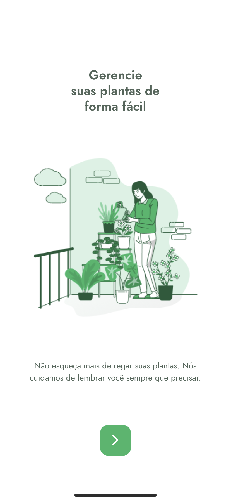
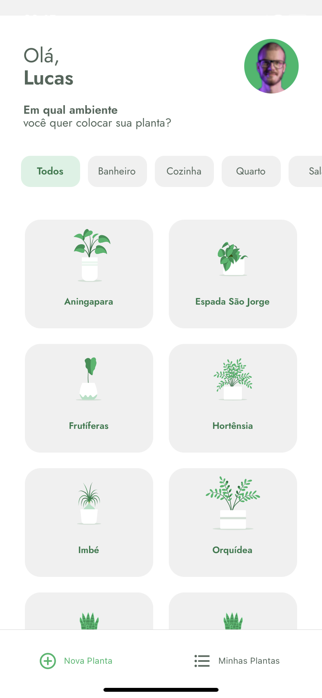
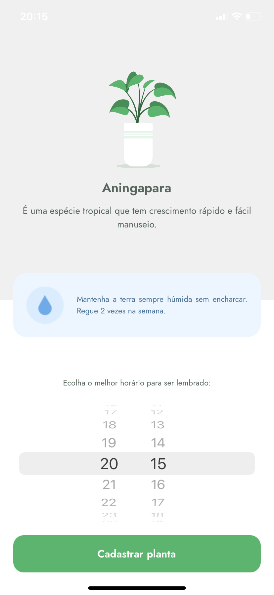

<h1 align="center">
  
   
 Plantmanager
</h1>

<h4 align="center">#5 NLW Rocketseat</h4>

  <a href="#rocket-technologies">Technologies</a>

  
   
  

## :rocket: Technologies

- [React-native](https://reactnative.dev/)
- [Typescript](https://www.typescriptlang.org)
- [styled-components](https://www.styled-components.com/)
- [lottie](https://github.com/lottie-react-native/lottie-react-native)

---

Made with ♥ by Lucas Aguiar :wave: [Get in touch!](https://www.linkedin.com/in/lucasaguiiar)
